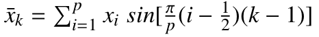
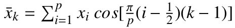
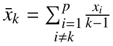

<p align="center">
  Repository of Several Notable Dynamic Programming Based Similarity Measure Algorithms </p>
<h1> DP-Dist </h1>   <br/> 

In this library of **Dynamic Programming Based Similarity Measure Algorithms**, we are trying to implement several notable algorithms for the calculation of the distance between two-time series or vectors or signals. This library is completely open-source and can be used for scientific and academic purposes.

A semple matlab code is shown in the following file, which depicts the use of various algorithms. Please see following file : 
```matlab
-- Simple_UCR_Test.m
```
These algorithms can be applied for the calculation of similarity (distance) between any two time series. Here, we have shown the examples by using the popularly known **UCR Time Series Classification Archive**
The archive can be downloaded from : https://www.cs.ucr.edu/%7Eeamonn/time_series_data_2018/

<br/>

<h2> Acknowledgments </h2>

We highly thank Prof. Eamonn Keogh, his collegues and numerous people who have contributed to the UCR time series classification archive for their numerous hours of selfless work. Plese visit the following link for more details on the archive : 
https://www.cs.ucr.edu/%7Eeamonn/time_series_data_2018/BriefingDocument2018.pdf

</br>

Following is the list of algorithms, which are implemented in this library :

<h3> 1.  &nbsp; Dynamic Time Warping (DTW) </h3>
<br/>
<div style="padding-left: 30px;">
Dynamic Time Warping (DTW) is a highly popular technique for measuring similarity between two different time series by finding their best correspondence. For more details, see : 
</div>
<br/>

- `Ratanamahatana, C., & Keogh, E. (2004). Everything you know about dynamic time warping is wrong. Third Workshop on Mining Temporal and Sequential Data, 22–25.`

<br/>
<div style="padding-left: 30px;">
The implementation can be found in :
</div>


```matlab
- DynamicTimeWarping(Data_Ref,Data_Target)
```


<h3> 2. &nbsp; Derivative Dynamic Time Warping (DDTW) </h3>
<br/>
<div style="padding-left: 30px;">
	The typical condition of classical DTW may lead to unexpected singularities (the alignments between a point of a series with multiple points of the other series) and unintuitive alignments. To overcome these weaknesses of DTW, DDTW transforms the original points into higher level features, which contain the structural information of the signal. This technique considers the first derivative of the signals instead of original signals. For more details, see : 
</div>
<br/>

- `Eamonn J. Keogh, M. J. P. (2000). Scaling up dynamic time warping for datamining applications. KDD, 285–289.`

<br/>
<div style="padding-left: 30px;">
The implementation can be found in :
</div>


```matlab
- Derivative_DynamicTimeWarping(Data_Ref,Data_Target)
```


<h3> 3.  &nbsp; Value Derivative Dynamic Time Wapring (VDDTW) </h3>
<br/>
<div style="padding-left: 30px;">
Standard DTW uses Euclidean metric for calculating the distance between the elements of target and query sequences. This distance is good to compare single points but not appropriate for comparing the vector sequences. One more intelligent way to calculate the distance is by giving consideration to  adjacent values of time series, which is sensitive on the local changes among time series elements. For more details, see : 
</div>
<br/>

- `Kulbacki, M., Kulbacki, M., Segen, J., Segen, J., Bak, A., & Bak, A. (2002). Unsupervised Learning Motion Models Using Dynamic Time Warping. Systems Research, July 2015, 1–10.`

<br/>
<div style="padding-left: 30px;">
The implementation can be found in :
</div>


```matlab
- ValueDerivative_DTW(Data_Ref,Data_Target)
```

<h3> 4.  &nbsp; Weighted Hybrid Dynamic Time Wapring (WHDTW) </h3>
<br/>
<div style="padding-left: 30px;">
The information from raw signal contains useful information and smoothing the raw signal helps to stabilize the process. Moreover, the derivative provides better knowledge. For example, the first derivative gives information on speed and the second derivative gives information on accelerations and decelerations. To handle the noise sensitiveness of DDTW, int this algorithm, the distance matrix is computed in different manner.  For more details, see : 
</div>
<br/>

- `Benedikt, L., Kajic, V., Cosker, D., Rosin, P. L., & Marshall, D. (2008). 
Facial Dynamics in Biometric Identification. Proceedings of the British Machine Vision Conference.`

<br/>
<div style="padding-left: 30px;">
The implementation can be found in :
</div>


```matlab
- WeightedHybrid_DTW(Data_Ref,Data_Target)
```

<h3> 5.  &nbsp; Non Isometric Transform Based Dynamic Time Wapring  </h3>
<br/>
<div style="padding-left: 30px;">
  In this algorithm, the authors proposed to use mathematical functions other than the derivative, to transform the signals. The idea is to choose some non-isometric transforms to calculate distances, which can bring some extra information, which seems to be useful in the domain of sequence matching. 
	The authors have proposed to use following three popular non isometric transforms : 
</div>
<br/>

<h4> &nbsp; &nbsp; &nbsp; &nbsp; &nbsp; &nbsp; &nbsp; 5.1 &nbsp; Sine Transform : </h4>
<p align="center">
  
</p>

<h4> &nbsp; &nbsp; &nbsp; &nbsp; &nbsp; &nbsp; &nbsp; 5.2 &nbsp; Cosine Transform : </h4>
<p align="center">
  
</p>
<h4> &nbsp; &nbsp; &nbsp; &nbsp; &nbsp; &nbsp; &nbsp; 5.3 &nbsp; Hilbert transform : </h4>
<p align="center">
  
</p>

 
  
For more details, see :


- `Górecki, T., & Luczak, M. (2014). Non-isometric transforms in time series classification using DTW. Knowledge-Based Systems, 61, 98–108. `

<br/>
<div style="padding-left: 30px;">
The implementation can be found in :
</div>


```matlab
- IsometricTransformDTW(Data_Ref,Data_Target,methodName)
```